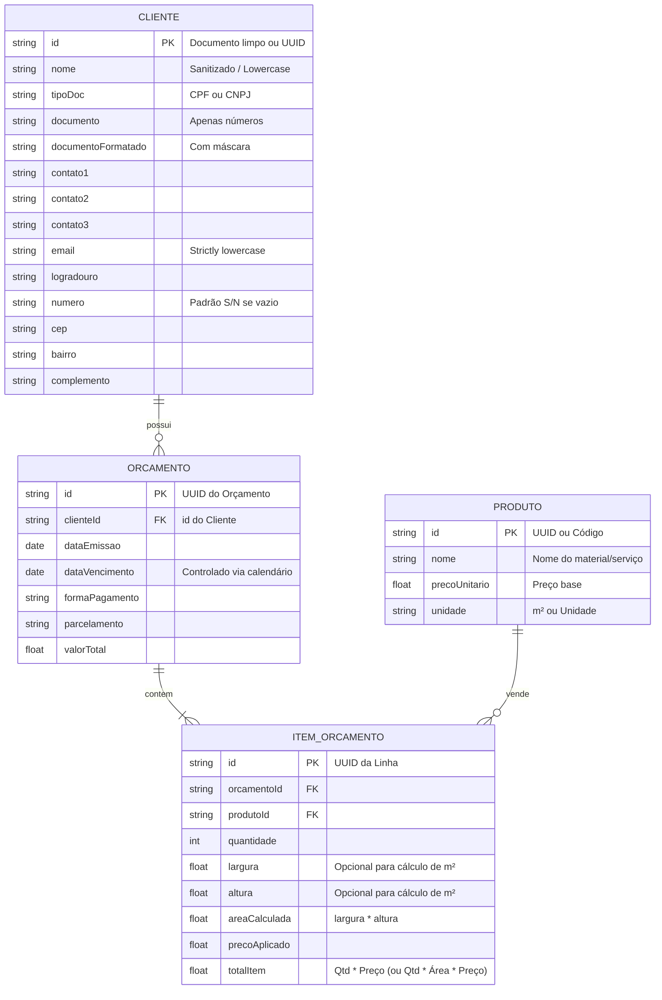

```mermaid
erDiagram
    CLIENTE {
        string id PK "Documento limpo ou UUID"
        string nome "Sanitizado / Lowercase"
        string tipoDoc "CPF ou CNPJ"
        string documento "Apenas números"
        string documentoFormatado "Com máscara"
        string contato1
        string contato2
        string contato3
        string email "Strictly lowercase"
        string logradouro
        string numero "Padrão S/N se vazio"
        string cep
        string bairro
        string complemento
    }

    PRODUTO {
        string id PK "UUID ou Código"
        string nome "Nome do material/serviço"
        float precoUnitario "Preço base"
        string unidade "m² ou Unidade"
    }

    ORCAMENTO {
        string id PK "UUID do Orçamento"
        string clienteId FK "id do Cliente"
        date dataEmissao
        date dataVencimento "Controlado via calendário"
        string formaPagamento
        string parcelamento
        float valorTotal
    }

    ITEM_ORCAMENTO {
        string id PK "UUID da Linha"
        string orcamentoId FK
        string produtoId FK
        int quantidade
        float largura "Opcional para cálculo de m²"
        float altura "Opcional para cálculo de m²"
        float areaCalculada "largura * altura"
        float precoAplicado
        float totalItem "Qtd * Preço (ou Qtd * Área * Preço)"
    }

    CLIENTE ||--o{ ORCAMENTO : "possui"
    ORCAMENTO ||--|{ ITEM_ORCAMENTO : "contem"
    PRODUTO ||--o{ ITEM_ORCAMENTO : "vende"
```
